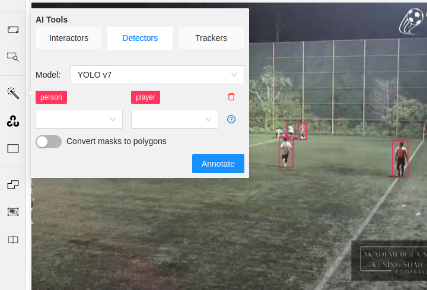

# Integrate custom YOLOv8 model into CVAT for automatic annotation.



## Run

Generally would follow this documentation (https://opencv.github.io/cvat/docs/administration/advanced/installation_automatic_annotation/)

In the CVAT directory, run:

1. ```
	docker compose down
	```

	Stop all containers first, if any.

1. ```
	docker compose -f docker-compose.yml -f components serverless/docker-compose.serverless.yml up -d
	```

	Start CVAT together with the plugin use for AI automatic annotation assistant.

1. ```
	wget https://github.com/nuclio/nuclio/releases/download/<version>/nuctl-<version>-linux-amd64
	```
	Install `nuctl`.*

1. ```
	sudo chmod +x nuctl-<version>-linux-amd64
	sudo ln -sf $(pwd)/nuctl-<version>-linux-amd64 /usr/local/bin/nuctl
	```

	After downloading the nuclio, give it a proper permission and do a softlink.*

1. ```
	./serverless/deploy_cpu.sh path/to/this/folder/
	```

	This will build the docker image and run the container. After it is done, you can use the model right away in the CVAT.

Note: * is a one time step.

## File Structure

- `function.yaml`: Declare the model so it can be understand by CVAT. It includes setup the docker environment.

- `main.py`: Contain the handle function that will serve as the endpoint used by CVAT to run detection.

- `custom-yolov8n.pt`: Your custom yolov8 model.

## References

1. https://opencv.github.io/cvat/docs/manual/advanced/serverless-tutorial/#adding-your-own-dl-models

	Official documentation on how to add the custome model.

1. https://stephencowchau.medium.com/journey-using-cvat-semi-automatic-annotation-with-a-partially-trained-model-to-tag-additional-8057c76bcee2